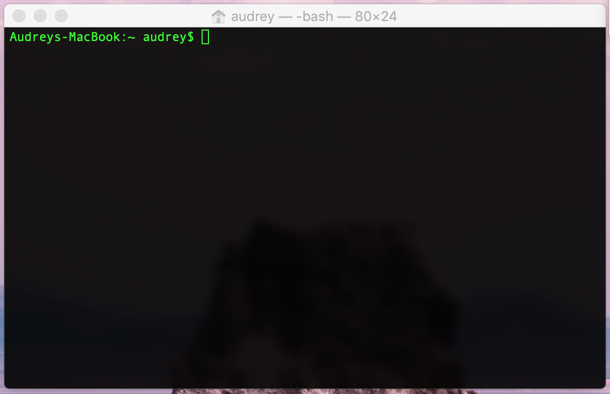
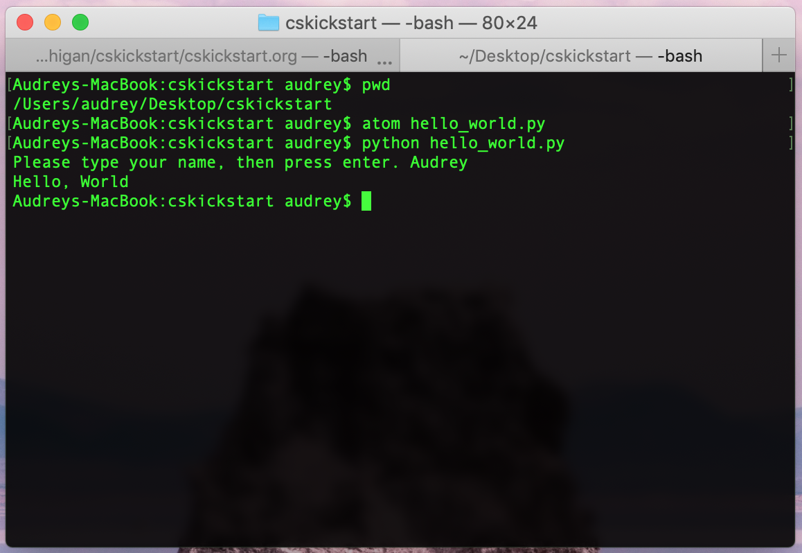

# Lab 1: Hello, World!

In this lab, we will introduce ourselves and go over the structure of all CS KickStart
labs going forward. You will then learn about Linux, shells, and programming languages,
and you'll even get to write and run your first program!

### Goals

* Cover lab structure  
* Setup programming environment  
* Run your first program  

## Lab Structure

CS KickStart labs are not graded. These labs are designed to teach and encourage critical
thinking rather than present direct content. If you have question, ask the instructor, officers,
or another participant at any time. Groupwork is always permitted, just remember to stop
your conversations when the instructor is presenting.

## Programming Environment

### Operating System

An operating system is the core of the computer. It's what makes it possible for you to interact
with your computer and the hardware. We're using the Linux operating system because it has features
that make it useful for programmers. Linux focuses more on giving you access to the nitty-gritty details
of controlling the computer, compared to some operating system's, like MacOS, that focus on making the
experience friendly for non-technical users. 

Linux is used in a lot of surpising places:

* Most machines that relay information across the internet  
* Over two-thirds of websites  
* All top 500 super computers  
* Many data centers  
* Even the entertainment systems on Delta Airlines!  

### Shell

A shell is an interface you can use to interact with the core of the computer. There are many kinds of shells.
One kind of shell is called a graphical user interface, or GUI. This is what you've been used to your whole life.
Another kind of shell is a command-line shell, or terminal. 

You may be wondering, why would you use a command-line shell over a GUI shell? Excellent question! Have you ever been a Windows user and tried to use a Mac? Or been a Mac user and tried to use Windows? It's not easy! With a new GUI, it's hard to figure out what you need to click on to do what you want. There is a standard interface for command-line shells called Unix. Unix provides a standard set of "verbs" (like `mv`) that you can use on "nouns" (like files). Both Linux and MacOS support Unix commands, so you can use the same set of verbs on any Linux or Mac computer. Overall, there are three main reasons to use a command-line shell over a GUI shell:

1. Having a standard “language” makes it much easier to work on a bunch of different computers that may have different GUIs, which you will do a lot as a computer scientist.
2. Many computers you'll work on won't not have screens or a GUI shell available. Your only option will be to use a command-line shell.
3. After some practice, you'll find a command-line shell much faster than a GUI shell.

#### Activity: Making a Folder Using the Command Line

Open up the terminal on your computer by searching for *terminal* among your computer's applications. You should
see a window that looks something like this (yours might be a different color):



You can do things in your terminal by typing commands into the command line. Here are some common commands, many of
which we'll use in this lab:

| Command                   | Effect |
| ------------------------- | -------------------- |
| `pwd`                     | Print path of current working directory |
| `ls`                      | List directory content |
| `mkdir <directory>`       | Create new directory named `<directory>` |
| `cd <directory>`          | Change directory to `<directory>` |
| `cd ..`                   | Change directory to parent directory |
| `cd ~`                    | Change directory to root directory |
| `cp <file> <directory>`   | Copy `<file>` to `<directory>` |
| `mv <file-old> <file-new>`| Rename `<file-old>` to `<file-new>` |
| `mv <file> <directory>`   | Move `<file>` to `<directory>` |

*Note: directory is just another name for folder.*

Change directories to the root directory by typing the command `cd ~` into your terminal and pressing enter. Then type `ls` to see the contents of the root directory. You should see a directory named `Desktop`. Change to the Desktop directory by typing `cd Desktop`. Type `pwd` to see the path of your current working directory and confirm that you're in the right place.

Now type the following commands to create a new directory named `cskickstart` (anything after the # symbol is a comment and won't be executed as part of the command):

```console
$ pwd                   # make sure that you're in the Desktop directory
$ ls                    # see the contents of the Desktop directory
$ mkdir cskickstart     # make a new directory called cskickstart
$ ls                    # see that cskickstart is now in the Desktop directory
$ cd cskiskstart        # change directory to the cskickstart directory
$ pwd                   # see that you're now in the Desktop/cskickstart directory
```

### Text Editor

A text editor lets you write, edit, and save text. It's like Notepad on Windows or TextEdit on Mac, but it has some nice additional features that are especially helpful for writing code. You'll be using the text editor Atom to complete your labs for CS KickStart. Go to the [Atom](https://atom.io) to download this application on your computer.

## Running a Program

Go to the [Lab 1 Google Drive Folder](https://drive.google.com/drive/folders/1WV3k_lI-cs5-FTsCT1whA4SzbjlXefoQ) and download `hello_world.py`. Move this file to the `cskickstart` directory you just created on your desktop. In your terminal, type the command `pwd` to make sure that you're in the `Desktop/cskickstart` directory. Type `ls` to see that `hello_word.py` is in the `cskickstart` directory, then type the command `atom hello_world.py`.

The Atom text editor should have opened, displaying the contents of `hello_world.py`. You're currently looking at some code written in the Python programming language. 

So what exactly is a programming language? A computer is a machine that speaks a particular language. To make a computer do things, you have to give it instructions in that particular language. High-level programming languages are close enough to English so that humans can write them, but they're also detailed enough to be translated into instructions a computer can understand. There are many different high-level pogramming languages. For most labs during CS KickStart, you'll be learning how to write code in Python.

Take a look at `hello_world.py` again. The `.py` extension tells us that this file is written in Python. Just like English, many programming languages break down into nouns (data) and verbs (functions). `print()` is a function and `"Hello, World"` is a piece of data called a string. All strings have quotation marks. Now in your teminal, type the command `python hello_world.py`. `python` is a command to start Python interpreter, a program that converts Python programs into computer intructions. Follow the instructions printed by the `hello_world.py` program to enter your name and press enter. You should see `Hello, World` printed in your terminal.



Congratulations! You've just run your first program!